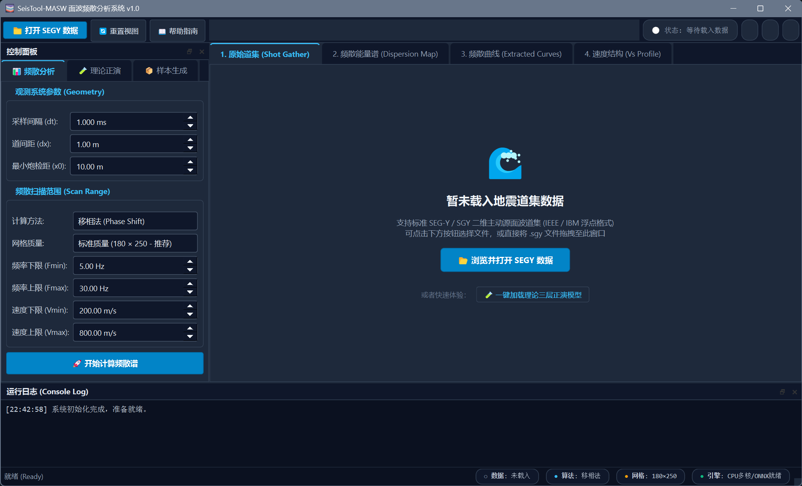
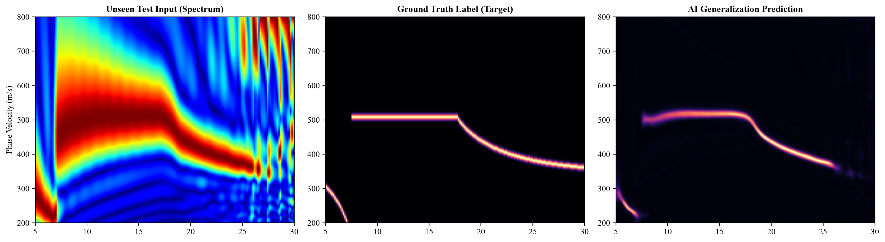
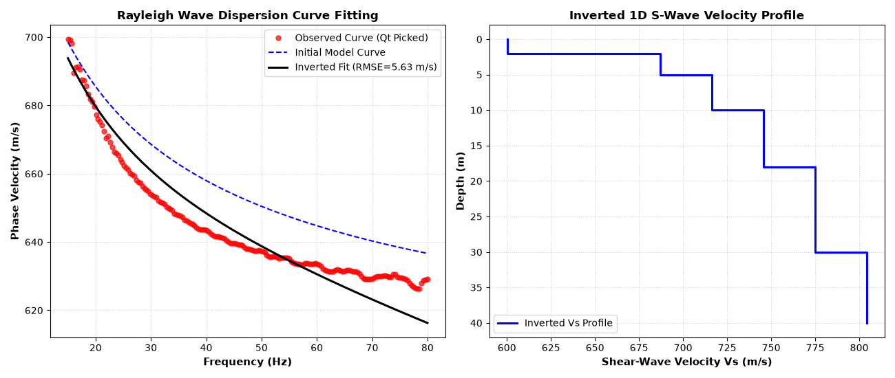
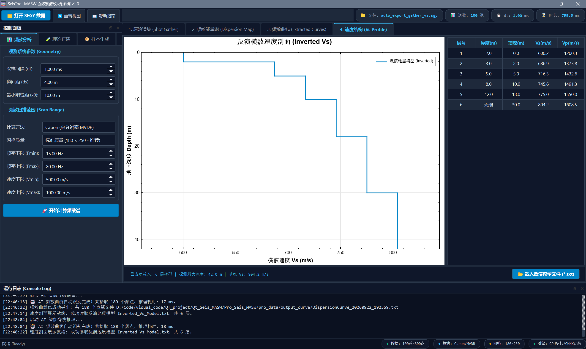

# SeisTool-MASW

**SeisTool-MASW** 是一个面向主动源面波处理的 Windows 桌面程序，提供 SEG-Y 道集浏览、频散能量计算与拾取、1D 横波速度反演，以及由 1D 模型生成的二维演示剖面。

> **当前二维剖面说明：** 页面 5 将 1D 分层 Vs 模型扩展到测线方向，并支持平滑横向扰动，用于初始模型展示和界面流程验证；它目前不执行真正的二维反演。

## 界面截图

截图保存在 `Pro_image/`，下列路径相对于本 README，克隆仓库后仍可直接显示。

### 主界面与数据处理



| 原始道集 | 频散能量谱 | 拾取曲线与反演质控 |
|:---:|:---:|:---:|
|  |  |  |

### 理论正演、模型训练与反演示例

| 正演道集 | 理论频散谱 | 理论曲线对比 |
|:---:|:---:|:---:|
|  |  |  |

| 模型训练示例 | 反演示例 | 反演结果示例 |
|:---:|:---:|:---:|
|  |  |  |

## 功能概览

- **SEG-Y 道集**：打开或拖入 `.sgy` / `.segy` 文件，查看 wiggle 波形和变密度底图；道集视图支持色带、增益、显示模式和图像/数据导出。
- **频散分析**：提供移相、F-K、Capon 和 τ-p 等频散能量计算方法；频散图下方控制项采用双行布局，窄窗口下仍可访问归一化、色带和拾取操作。
- **AI 辅助拾取**：在模型文件和 ONNX Runtime 可用时，可使用随项目提供的频散脊线模型。
- **1D Vs 反演**：根据拾取曲线估计分层横波速度，并查看速度剖面和地层参数。
- **二维演示剖面**：页面 5 将当前 1D 模型横向扩展，可设置测线长度、网格、色带和横向扰动。此功能用于模拟初始模型，不是二维反演结果。
- **主题切换**：主窗口右上角调色板按钮可选择十种界面风格（清爽米绿、优雅薰衣草、冰川静蓝、夏日草甸、经典白色、深邃蓝灰、海盐薄荷、樱雾玫瑰、暖阳砂岩和暮色靛蓝）；经典白色 MATLAB 风格为默认，选择会保存在本机设置中。
- **理论正演**：配置分层参数生成理论频散曲线和合成道集，便于检查处理流程。

## 处理流程

```text
SEG-Y 道集 ──> 频散能量谱 ──> 曲线拾取 ──> 1D Vs 反演 ──> 1D 速度剖面
    │                                                        │
    └── 图像/SEG-Y 导出                                       └──> 页面 5 二维演示初始模型
```

页面 5 的横向变化是合成扰动。要形成真正的二维面波反演剖面，后续还需要沿测线移动观测、分窗/多炮频散曲线、横向参数化和正则化反演等模块。

## 编译与运行

### 当前项目配置

- Windows x64
- Visual Studio 2026 / MSVC v145（项目使用 Qt VS Tools）
- Qt 6.6.3，项目配置的套件名为 `6.6.3_msvc2019_64`
- C++17、OpenMP、Eigen 以及 QCustomPlot
- ONNX Runtime C++ 1.30（AI 拾取功能）

### 编译

1. 用 Visual Studio 打开仓库上一级目录中的 `Qt_Seis_MASW.sln`。
2. 选择 `Release` 和 `x64`。
3. 确认 Qt VS Tools 能找到项目中配置的 Qt 6.6.3 套件。
4. 确认 Eigen include 路径有效。ONNX Runtime 的 include/lib 路径目前配置在 `Pro_Seis_MASW.vcxproj` 中；换电脑时需改为本机 SDK 路径。
5. 生成解决方案，并从生成目录启动 `Qt_Seis_MASW.exe`。运行时还需确保 Qt 插件、ONNX Runtime DLL 和模型文件可被程序找到。

也可以在 Visual Studio Developer PowerShell 中构建：

```powershell
msbuild ..\Qt_Seis_MASW.sln /m /p:Configuration=Release /p:Platform=x64
```

依赖库、Qt 套件和运行时 DLL 未随仓库完整打包；新环境需要先配置相应依赖。

## 目录结构

```text
Qt_Seis_MASW/
├── Qt_Seis_MASW.sln
├── AI_Train_MASW/             # AI 训练数据与相关实验资源
└── Pro_Seis_MASW/
    ├── Pro_Seis_MASW.cpp/.h   # 主窗口和界面逻辑
    ├── Pro_h/                 # 组件与算法接口
    ├── Pro_cpp/               # SEG-Y、绘图、正演和反演实现
    ├── Pro_image/             # README 使用的截图
    ├── Python_script/         # 绘图及反演辅助脚本
    ├── models/                # ONNX 拾取模型
    ├── pro_data/              # 示例输入与导出结果
    ├── icon/                  # 程序图标资源
    ├── qcustomplot.cpp/.h     # QCustomPlot 绘图库
    ├── style.h                # 界面主题和样式
    └── README.md
```

## 数据与结果

`pro_data/` 中包含示例 SEG-Y、频散曲线、模型和绘图结果。请将其视为项目数据保留；清理构建文件时不要删除该目录。程序还支持将拾取曲线、剖面图和道集按相应功能导出。

## 许可证与第三方组件

项目使用的第三方组件分别遵循其自身许可证。分发程序或依赖库前，请核对 Qt、QCustomPlot、Eigen、ONNX Runtime 及模型文件的许可证和分发条款。
