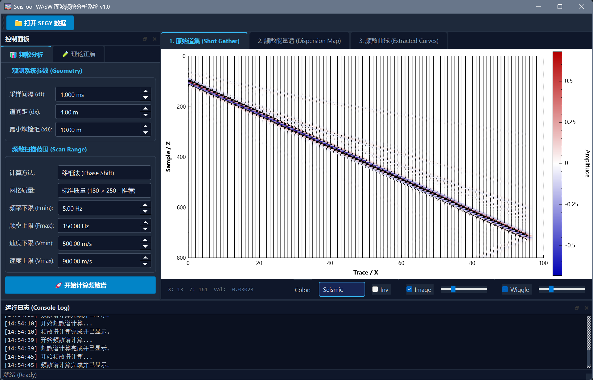
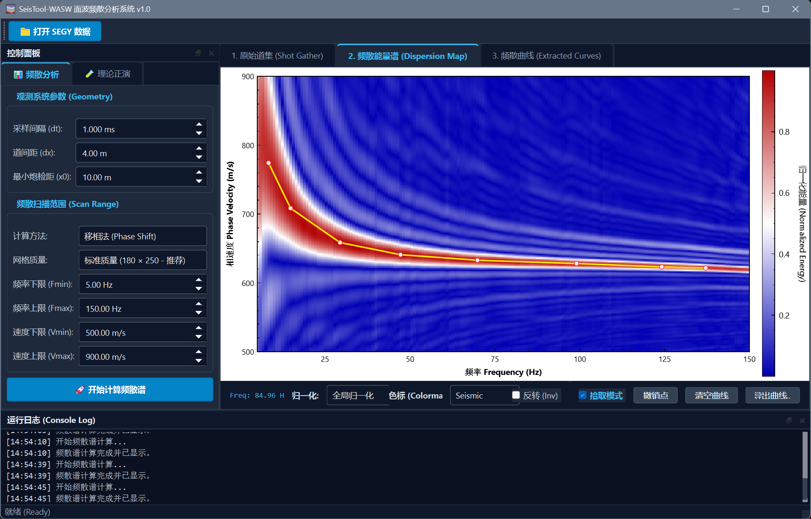
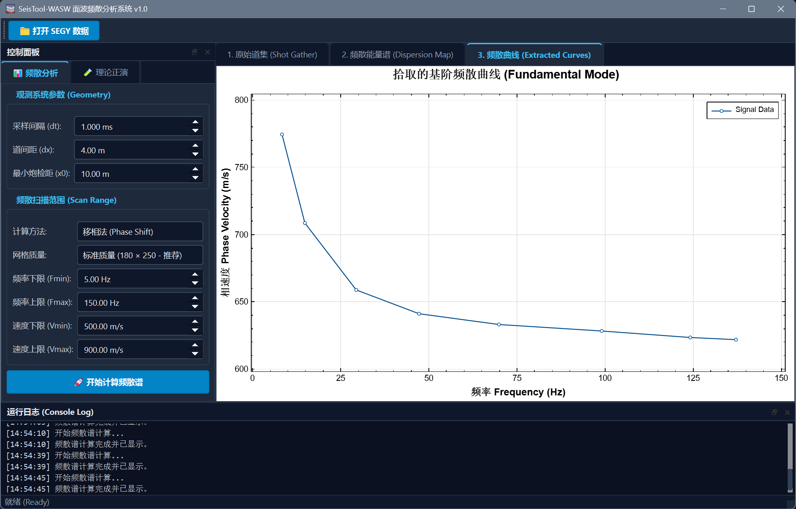
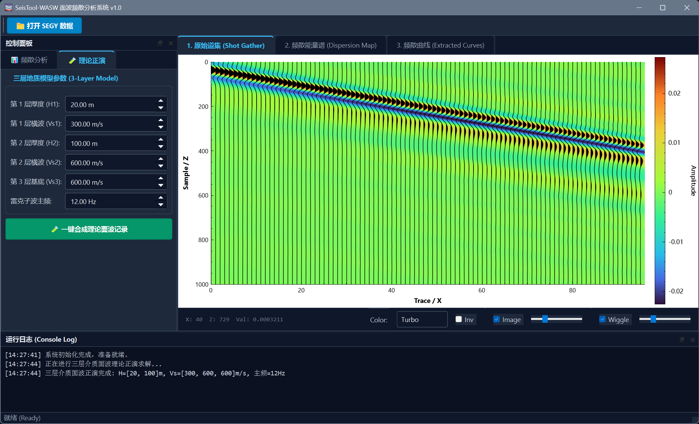
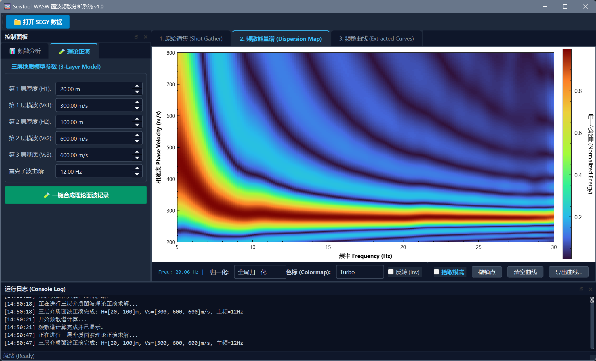
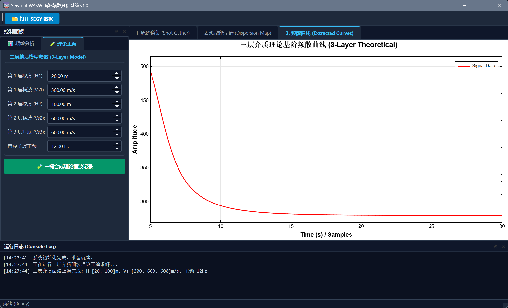

---

# SeisTool-WASW 面波频散分析与处理系统

[](https://isocpp.org/)
[](https://www.qt.io/)
[](https://eigen.tuxfamily.org/)
[](https://www.openmp.org/)
[-lightgrey.svg)]()

**SeisTool-WASW** 是一款面向近地表地球物理工程勘察的专业面波频散分析与正演模拟系统（MASW，Multichannel Analysis of Surface Waves）。系统集成了全格式 SEGY 地震道集解析、多模式剖面显示（Wiggle/ColorMap）、层状介质理论面波正演合成、基于 Eigen+OpenMP 的多核并行移相法能量谱计算、交互式局部极大值自动吸附拾取（Snap-to-Peak）以及出版级科研图表成图与数据导出功能。

## 界面与效果预览

| 原始道集与波形剖面 (Tab 1) | 频散能量谱与自动吸附拾取 (Tab 2) | 频散曲线对比与反演质控 (Tab 3) |
| :---: | :---: | :---: |
|  |  |  |
|  |  |  |
| *Wiggle 抖动线 + 变面积填充叠加变密度* | *移相法相速度谱（支持色标/归一化切换）* | *Plot1D 期刊级展示（实测点与理论线叠合）* |

---

## 目录
- [核心功能特性](#核心功能特性)
- [系统架构与工作流](#系统架构与工作流)
- [核心算法与数学原理](#核心算法与数学原理)
- [开发环境与依赖项](#开发环境与依赖项)
- [编译与运行配置](#编译与运行配置)
- [项目目录结构](#项目目录结构)
- [数据输入与导出规范](#数据输入与导出规范)
- [Python 辅助工具链](#python-辅助工具链)
- [许可证与致谢](#许可证与致谢)

---

## 核心功能特性

### 1. 专业地震数据读取与剖面成像（Tab 1: Shot Gather）
* **全格式 SEGY 读取**：支持 IBM Float（代码 1）及 IEEE Float（代码 5）大端序地震数据的快速解码，自动解析二进制卷头及道头参数（道数、采样率 $dt$、采样点数 $nt$）。
* **双层混合渲染**：支持**变密度热力图（ColorMap）**与**地震抖动波形（Wiggle）/ 正半周变面积填充（Variable Area）**的无缝叠合呈现。
* **视口裁剪与 LOD 渲染**：针对大规模多道测线数据，内置屏幕视口裁剪（Frustum Culling）和基于像素分辨率的动态步长绘制（Level of Detail），确保上千道数据缩放平移丝滑流畅。
* **数据双向导出**：支持将当前加载或理论合成的道集一键右键另存为标准 **SEGY (*.sgy)** 文件。

### 2. 高效移相法频散计算（Tab 2: Dispersion Map）
* **经典相移变换**：基于经典 Park (1998) 移相法，将时空域波场 $u(x, t)$ 映射至高分辨率频率-相速度 $E(f, v)$ 能量谱。
* **频域复数线性插值**：采用相邻 FFT 频点复数线性加权插值与纯相位重归一化算法，**彻底消除了离散傅里叶频点量化引起的“平顶台阶效应”**。
* **多核并行加速**：基于 `Eigen::FFT` 与 `OpenMP` 实现频域相移多线程扫描，计算耗时缩短至毫秒级。
* **双模式归一化（1 毫秒免重算切换）**：
  * **按频率归一化（每列归一，推荐）**：消除源子波振幅不均影响，使全频段能量峰值达到 $1.0$（深红），基阶与高阶条带清晰连续；
  * **全局归一化**：真实保留激发能量在不同频段的空间衰减特征。
* **清晰色块 / 平滑插值一键切换**：右键支持在 MATLAB 风格离散网格块（Nearest）与双线性平滑渲染（Bilinear）之间自由切换。

### 3. 智能曲线拾取与联动（Tab 2 $\leftrightarrow$ Tab 3）
* **局部极大值自动吸附（Snap-to-Peak）**：在能量谱脊线上点击时，算法自动在垂直方向（$\pm 15$ 个速度网格）搜索局部极大值峰顶，彻底规避人工手动拾取的抖动误差。
* **实时双向图层联动**：
  * 页面二（热力图）同步覆盖醒目的亮黄色连线与红白拾取散点；
  * 页面三（`Plot1D`）自动对拾取离散点进行频率升序排序，生成封闭边框（Box Style）期刊级散点折线图。
* **容错与编辑**：支持单点撤销（Undo）、点位重复覆盖更新及一键清空曲线。

### 4. 层状介质理论正演模拟（Forward Modeling）
* **Schwab-Knopoff 理论频散求解**：内置高效层状弹性半空间特征超越方程求解器，采用双曲正切消指数增长技术，根治了传统 Thomson-Haskell 传递矩阵的高频数值溢出问题。
* **多层模型支持**：支持双层、三层及任意 $N$ 层速度递增或低速夹层地质模型的理论基阶频散曲线正演计算。
* **物理频散面波记录时域合成**：基于雷克子波振幅谱与理论相速度相移调制，通过逆傅里叶变换（IFFT）直接合成具有真实物理频散效应的数十道地震记录。

### 5. 辅助时频信号分析工具箱
内置面向单道/多道地震信号的完整分析模块：
* 连续小波变换（Morlet CWT，集成内存安全防护机制）
* S 变换（Stockwell Transform）与短时傅里叶变换（STFT）
* 变分模态分解（VMD）
* 希尔伯特包络分析（Hilbert Envelope）
* 韦尔奇功率谱密度估计（Welch PSD）

---

## 系统架构与工作流

```text
       ┌────────────────────────┐         ┌────────────────────────┐
       │   外场实测 SEGY 数据   │         │   1D 地层模型参数输入   │
       │   (*.sgy / *.segy)     │         │   (H, Vs, Vp, Density) │
       └───────────┬────────────┘         └───────────┬────────────┘
                   │                                  │
                   ▼                                  ▼
┌──────────────────────────────────────┐  ┌───────────────────────────────┐
│ Tab 1: 原始地震道集剖面展示与分析     │  │ 理论正演模块 (Forward Solver) │
│ - Wiggle 抖动线 / 变面积填充 / 热力图 │◄─┤ - Schwab-Knopoff 传递矩阵求根 │
│ - 增益滑块 / 右键导出合成 SEGY 记录  │  │ - 频域相位调制 + IFFT 时域合成│
└──────────────────┬───────────────────┘  └───────────────┬───────────────┘
                   │ 几何与网格参数 (dt, dx, x0, f, v)    │
                   ▼                                      │ 理论频散相速度
┌──────────────────────────────────────────────────────┐  │
│ Tab 2: 移相法相速度-频率能量谱 (Dispersion Map)       │  │
│ - 频域复数插值 + OpenMP 并行相移叠加                 │  │
│ - [开启拾取] -> 鼠标点选触发 Snap-to-Peak 局部峰值吸附│  │
│ - 右键导出频散能量谱为 SEGY / 切换平滑无模糊滤镜     │  │
└──────────────────┬───────────────────────────────────┘  │
                   │ 实时数据流同步                       │
                   ▼                                      │
┌──────────────────────────────────────────────────────┐  │
│ Tab 3: 频散曲线对比与反演质控 (Extracted Curves)      │  │
│ - Plot1D 封闭边框期刊级展示                          │  │
│ - 拾取实测点与理论基阶红线叠合比对 (质控质检)        │◄─┘
│ - 一键导出反演标准三列文本 (Freq, PhaseVel, Lambda)  │
└──────────────────┬───────────────────────────────────┘
                   │
                   ▼
       [直接输入 1D S波速度反演内核]
```

---

## 核心算法与数学原理

### 1. 移相法空间叠加公式 (Park et al., 1998)
对时空波场信号进行时间向傅里叶变换并执行振幅归一化：
$$P(x_j, \omega) = \frac{U(x_j, \omega)}{|U(x_j, \omega)|}$$

沿设定相速度 $v$ 扫描，执行空间相位干涉补偿叠加：
$$E(v, f) = \frac{1}{N} \left| \sum_{j=1}^{N} P(x_j, 2\pi f) \cdot \exp\left(i \frac{2\pi f \cdot x_j}{v}\right) \right|$$

其中 $x_j = x_0 + (j-1)\Delta x$ 代表第 $j$ 道检波器的实际物理偏移距，$x_0$ 为最小炮检距，$\Delta x$ 为道间距。

### 2. 层状介质基阶瑞雷面波相速度求解
利用 Schwab-Knopoff 降阶 Delta 矩阵算法消除指数溢出项，求解超越特征方程：
$$F(c, \omega; \mathbf{H}, \mathbf{V_s}, \mathbf{V_p}, \mathbf{\rho}) = 0$$
从高频表层渐近值（$c \approx 0.92 V_{s, \text{top}}$）出发，利用 Brent-Dekker 混合求根算法沿频率逆向追踪，确保数值解收敛于基阶模态。

---

## 开发环境与依赖项

* **操作系统**：Windows 10 / 11 (x64)
* **开发环境**：Microsoft Visual Studio 2019 / 2022 (MSVC v142/v143)
* **GUI 框架**：Qt 5.12+ 或 Qt 6.x（Qt Widgets 模块）
* **核心依赖库**：
  * **Eigen 3.3+**：纯头文件 C++ 矩阵库，包含 `<unsupported/Eigen/FFT>` 快速傅里叶变换模块
  * **QCustomPlot 2.1+**：高级科学绘图渲染引擎
  * **OpenMP**：多核指令级并行加速库

---

## 编译与运行配置

在使用 Visual Studio 编译本工程时，请确保开启以下三项关键编译选项：

1. **启用扩展对象格式 `/bigobj`**（解决 Eigen 复杂模板深度展开引发的 C1128 错误）：
   * 项目属性 $\to$ **C/C++** $\to$ **命令行** $\to$ 其他选项添加：`/bigobj`
2. **启用 UTF-8 源代码编码 `/utf-8`**（解决 MSVC 中文字符断句与 C2143 语法错误）：
   * 项目属性 $\to$ **C/C++** $\to$ **命令行** $\to$ 其他选项添加：`/utf-8`
3. **启用 OpenMP 多线程加速**：
   * 项目属性 $\to$ **C/C++** $\to$ **语言** $\to$ **OpenMP 支持** $\to$ 设为 **是 (/openmp)**。

---

## 项目目录结构

```text
Qt_Seis_WASW/
├── Pro_h/                        # 核心接口头文件
│   ├── Plot1D.h                  # 1D 专业科研图表组件 (QCustomPlot 派生类)
│   ├── QCPSeismicWiggle.h        # 地震波形抖动线与变面积填充 Plottable
│   ├── SeismicIO.h               # SEGY 数据底层解析与导出接口
│   ├── SeismicView2D.h            # 2D 剖面多功能查看器接口
│   ├── SignalProcessingUtils.h   # 频散相移法、小波变换、STFT、VMD 算法库
│   └── RayleighForwardSolver.h   # 层状介质理论频散求解与面波时域合成器
├── Pro_cpp/                      # 算法与组件实现源码
│   ├── Plot1D.cpp
│   ├── QCPSeismicWiggle.cpp
│   ├── SeismicIO.cpp
│   ├── SeismicView2D.cpp
│   ├── SignalProcessingUtils.cpp
│   └── RayleighForwardSolver.cpp
├── Python_script/                # 独立 Python 后处理与成图脚本库
│   ├── plot_seismic_gather.py    # 炮集 Wiggle/变面积/灰度剖面成图脚本
│   └── plot_dispersion_map.py    # 导出的频散谱 SEGY 300-DPI 高清成图脚本
├── Pro_image/                    # 系统截图与说明图谱
│   ├── main1.png
│   ├── main2.png
│   └── main3.png
├── style.h                       # 全局 Slate 深色科技风格 QSS 样式定义
├── Pro_Seis_WASW.h               # 主窗口逻辑控制器声明
├── Pro_Seis_WASW.cpp             # 业务流程、UI 交互与拾取逻辑实现
├── main.cpp                      # 应用程序入口
└── README.md                     # 项目说明文档
```

---

## 数据输入与导出规范

### 1. 输入数据规范
* 标准地震勘探 **SEG-Y / SGY** 文件（二维主动源面波单炮记录，Common Shot Gather）。
* 兼容微动台阵与连续线性排列观测记录。

### 2. 导出数据格式

#### A. 频散曲线文本（供反演软件使用）
点击 **【导出曲线...】** 生成的标准三列地学 ASCII 文本文件，可直接供 CPS330 (`surf96`)、Geopsy 或自研反演算法调用：

```text
# Frequency(Hz)    PhaseVelocity(m/s)    Wavelength(m)
5.000              324.50                64.90
7.500              298.20                39.76
10.000             276.40                27.64
12.500             255.80                20.46
...                ...                   ...
```

#### B. 二维频散能量谱 / 合成道集 SEGY 文件
* **频散谱导出**：右键点击能量谱选择 **【💾 导出频散能量谱为 SEGY】**，生成以频率为道（$N_f$）、相速度为采样点（$N_v$）的标准浮点 SEGY 文件。
* **合成道集导出**：在道集视图中右键选择 **【💾 导出道集为 SEGY】**，将正演模拟的波形导出为工业标准地震文件。

---

## Python 辅助工具链

项目在 `Python_script/` 目录下配套提供了两套独立的 Python 后处理工具：
1. **`plot_seismic_gather.py`**：基于 `segyio` 与 `matplotlib` 读取地震道集，支持自动计算时间轴、自适应调整增益并输出 300-DPI Wiggle 波形与灰度剖面；
2. **`plot_dispersion_map.py`**：专用于读取本系统导出的频散谱 `.sgy` 文件，支持物理坐标自动映射（Hz 与 m/s）及双三次平滑抗锯齿成图。

---

## 许可证与致谢

本项目基于科研与工程实践开发。底层绘图组件遵循 **GPLv3 / QCustomPlot 商业许可**；矩阵运算与快速傅里叶变换依赖开源 **Eigen** 库；地层正演超越方程基于 Schwab-Knopoff 理论实现。
```